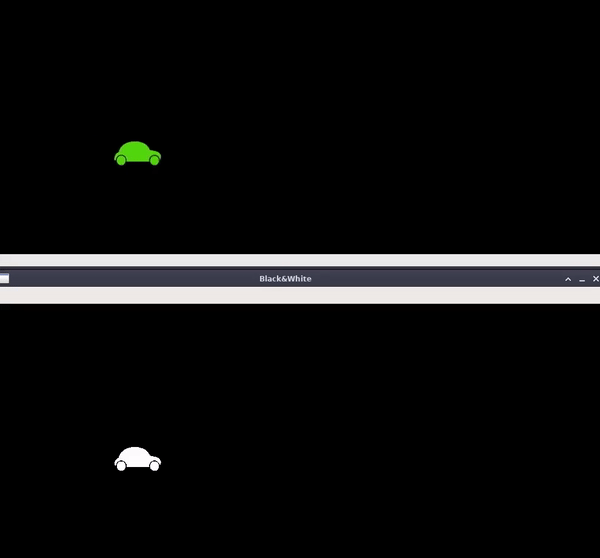
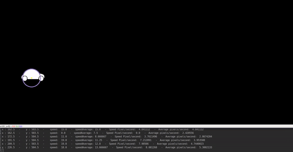
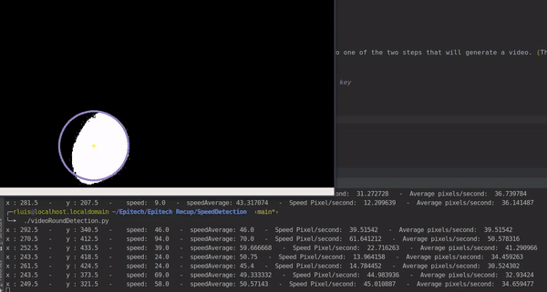

# Speed Detection

The goal of the project is to detect the speed of an object through three steps:
- Color detection (green or blue to black and white)
- Shape detection (via color)
- Detection of the center of the object (via the shape)
- Velocity judgment (v = d / t)

## Goals

- Video support (work with photos / video and camera)
- Detection of a specific object (via the 3 steps: color detection, shape and finally the center of the object)
- Object speed detection
- Minimization of errors and the cost function (deletion of extravagant data, if any)

## Requirements

* Python 3.7+


* opencv_python >= 4.2.0.34
* numpy >= 1.16.4
* picamera >= 1.13

How to install all the requirements :
```bash
sudo pip3 install -r requirements.txt
```

## Usage

### Color detection (Step 1)

You can test the color detection with three programs :
- Green detection from webcam
- Green detection from video (car example) -> needed for step 2
- Blue detection from video (bouncy ball example) -> need for step 2

#### Green detection from webcam

If you want to test the color detection thanks to your camera (works with flashy green) :

###### Exit with ctrl + C in terminal or "q" key
```bash
./cameraGreenDetection.py
```


#### Green detection from video (car example)

This will generate a black and white video (outpyColor.avi) from an other one.
It will only generate white when there is green on the original video.
If you want to test it :

###### Exit with ctrl + C in terminal or "q" key
```bash
./videoGreenDetection.py
```


#### Blue detection from video (bouncy ball example)

This will generate a black and white video (outpyColor.avi) from an other one.
It will only generate white when there is blue on the original video.
If you want to test it :

###### Exit with ctrl + C in terminal or "q" key
```bash
./videoBlueDetection.py
```


### Shape and speed detection (Step 2)

For shape and speed detection you need to do one of the two steps that will generate a video. (This step is based on the generated video) :
- Blue detection (bouncy ball example)
- Green detection (car example)

###### Exit with ctrl + C in terminal or "q" key
```bash
./videoRoundDetection.py
```

With the car example :


With the bouncy ball example :


## Authors

* **Luis Rosario** - *Member 1* - [Luisrosario](https://github.com/Luisrosario2604)
